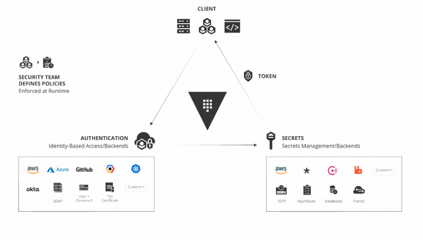
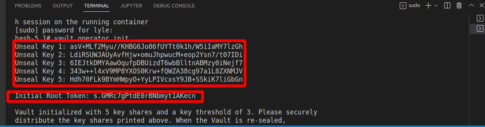
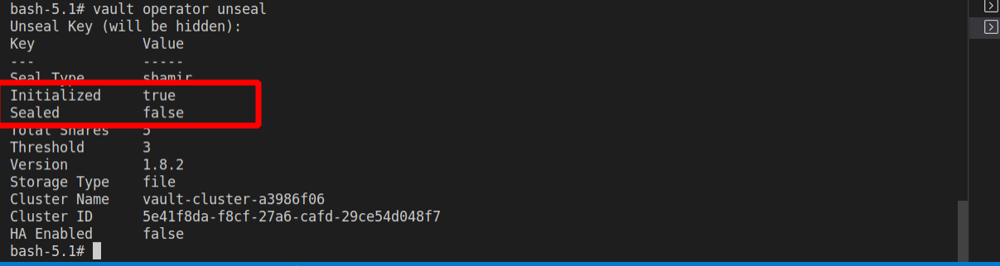
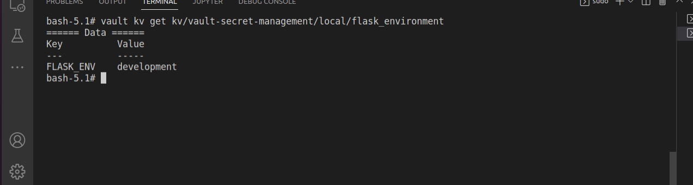
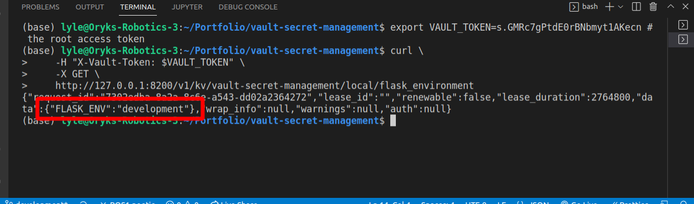

# vault-secret-management
> This is a containerized application that sets up a vault server for managing secrets using the kv engine.



## Introduction

What is a secret? Secrets, in the context of this tutorial, are securely-sensitive or personally identifiable info like database credentials, SSH keys, usernames and passwords, AWS IAM credentials, API tokens, Social Security Numbers, credit card numbers, just to name a few.To execute a flask application that uses a Database, a few secrets need to be set:

- The flask environment i.e development as FLASK_ENV
- The flask app, as FLASK_APP
- The database credentials, as POSTGRES_USER, POSTGRES_PASSWORD, POSTGRES_HOST, POSTGRES_PORT and the POSTGRES_DB.
- The app secret as SECRET_KEY.
- 
This is where Vault comes in. To read the whole article, navigate to [How to Manage Application Secrets with Hashicorp’s Vault.](https://medium.com/@lyle-okoth/how-to-manage-application-secrets-with-hashicorps-vault-865216896a39)

## Vault Setup

#### Clone the [vault-secret-management-repo](https://github.com/twyle/vault-secret-management)

```sh
git clone https://github.com/twyle/vault-secret-management.git
```

### Navigate into the cloned repo

```sh
cd vault-secret-management
```

### Start the Vault server

```sh
sudo docker-compose up -d --build
```

### Get a bash shell on the running container

```sh
sudo docker-compose exec vault bash
```

### Initialize Vault

Within the bash session

```sh
vault operator init
```

This gives you the 5 unseal keys and the root token. Store these safely.




### Unseal vault

Within the bash session, run this command three times, ech time supplying a different unseal key.

```sh
vault operator unseal
```



### Log into Vault

Within the bash session

```sh
vault login
```

## Secret Creation

After initializing and unsealing vault, you can now create secrets. To create key value pairs, you will need to enable the kv engine

### Enable the kv engine

At the bash session:

```sh
vault secrets enable kv
```

### Write a secret at the bash session

```sh
vault kv put kv/vault-secret-management/local/flask_environment FLASK_ENV=development
vault kv put kv/vault-secret-management/local/flask_app FLASK_APP=api/__init.py
```

### Read a secret at the bash session

```sh
vault kv get kv/vault-secret-management/local/flask_environment
```



### Read a secret over HTTPS

```sh
curl \
 -H “X-Vault-Token: $VAULT_TOKEN” \
 -X GET \
 http://127.0.0.1:8200/v1/kv/vault-secret-management/local/flask_environment
```



### Read secrets into a .env file

```sh
chmod +x ru.sh
./run.sh
```

This generates a .env file

```sh
FLASK_APP=api/__init.py
FLASK_ENV=development
SECRET_KEY=null
POSTGRES_HOST=null
POSTGRES_DB=null
POSTGRES_PORT=null
POSTGRES_USER=null
POSTGRES_PASSWORD=null
```

